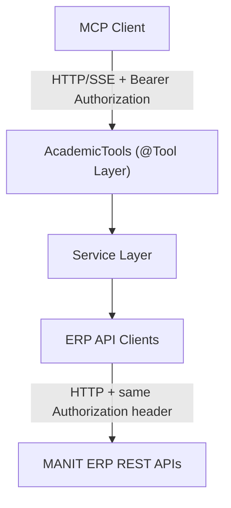

# MANIT Student ERP MCP Server

A **Model Context Protocol (MCP) Server** built with **Java 21**, **Spring Boot**, and **Spring AI MCP Server**. It connects to university ERP endpoints (`erpapi.manit.ac.in`) and exposes student academic, fee, and faculty details as MCP tools.

---

## Architecture Overview



The MCP server does not verify bearer-token signatures or validity. It requires a syntactically valid `Authorization: Bearer <token>` header on the SSE connection and each MCP message request, then forwards that request's header to the ERP API. The ERP backend is responsible for deciding whether the token is valid.

## MCP Tools Overview

| Tool Name | Description | Input Parameters | Return Response |
|---|---|---|---|
| `getFeeDetailsPerSemester` | Returns complete fee details and line-item breakdown for a specific semester. | `semester` (`int`, mandatory) | `FeePerSemesterResponse` |
| `getFeeDetailPerItem` | Retrieves student fee details filtered by item title, semester, or amount range. | `item`, `semester`, `minAmount`, `maxAmount` (optional) | `FeeDetailResponse` |
| `getSubjectMarksPerSubject` | Returns examination marks, grade, grade points, and credits for a subject. | `subject` (`String`, mandatory) | `SubjectMarksResponse` |
| `getSubjectFacultyPerSubject` | Returns faculty and course details for a subject. | `subject` (`String`, mandatory) | `SubjectFacultyResponse` |

## HTTP/SSE Client Configuration

Run the server, then configure an MCP client that supports HTTP/SSE and custom request headers to connect to:

```text
http://localhost:8080/mcp/sse
```

Configure the client to send this header on the SSE connection and on every MCP message request:

```http
Authorization: Bearer <your-ERP-token>
```

The header must be forwarded by any proxy or bridge used by the client. The server passes the original header through to ERP API requests and does not use a server-side `ERP_AUTH_TOKEN`. Do not log or expose the token in client configuration shared with others.

The legacy stdio transport does not carry HTTP request headers and therefore cannot use this per-request token-forwarding flow.

## Build and Run Locally

### Prerequisites
- **Java 21+** (`java -version`)
- **Apache Maven 3.9+** (`mvn -version`)

### Build

```bash
mvn clean package -DskipTests=false
```

### Run

```bash
java -jar target/student-erp-mcp-server-1.0.0-SNAPSHOT.jar
```

## Sample Prompts

1. *"Show my fee details for semester 5."*
2. *"How much is my Hostel Rent?"*
3. *"Show my library fee for semester 5."*
