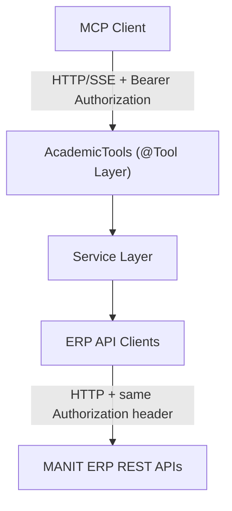

# MANIT Student ERP MCP Server

A **Model Context Protocol (MCP) Server** built with **Java 21**, **Spring Boot**, and **Spring AI MCP Server**. It connects to university ERP endpoints (`erpapi.manit.ac.in`) and exposes student academic, fee, and faculty details as MCP tools.

---

## Architecture Overview



The MCP server does not verify bearer-token signatures or validity. It requires a syntactically valid `Authorization: Bearer <token>` header on the SSE connection and each MCP message request, then forwards that request's header to the ERP API. The ERP backend is responsible for deciding whether the token is valid.

## MCP Tools Overview

| Tool Name | Description | Input Parameters | Return Response |
|---|---|---|---|
| `getFeeDetailsPerSemester` | Returns complete fee details and line-item breakdown for a specific semester. | `semester` (`int`, mandatory) | `FeePerSemesterResponse` |
| `getFeeDetailPerItem` | Retrieves student fee details filtered by item title, semester, or amount range. | `item`, `semester`, `minAmount`, `maxAmount` (optional) | `FeeDetailResponse` |
| `getSubjectMarksPerSubject` | Returns examination marks, grade, grade points, and credits for a subject. | `subject` (`String`, mandatory) | `SubjectMarksResponse` |
| `getSubjectFacultyPerSubject` | Returns faculty and course details for a subject. | `subject` (`String`, mandatory) | `SubjectFacultyResponse` |

## Connect an AI Agent

The hosted MCP server URL is:

```text
https://manit-erp-mcp.onrender.com/mcp/sse
```

Every connection must include your ERP bearer token in this HTTP header:

```http
Authorization: Bearer YOUR_TOKEN
```

Replace `YOUR_TOKEN` with your own token. Keep it private and do not commit it or share configuration files containing it. If you are running the server locally instead, use `http://localhost:8080/mcp/sse`.

### Claude Desktop (Windows)

1. In Claude Desktop, open **Settings → Developer → Edit Config**. This opens Claude's configuration folder.
2. In that folder, create a plain-text file named `erp-headers.txt` with this single line:

   ```text
   Authorization: Bearer YOUR_TOKEN
   ```

3. Copy the full path to `erp-headers.txt`. Open `claude_desktop_config.json` and add the following under `mcpServers`:

   ```json
   {
     "mcpServers": {
       "student-erp": {
         "command": "C:\\Program Files\\nodejs\\npx.cmd",
         "args": [
           "--yes",
           "mcp-remote",
           "https://manit-erp-mcp.onrender.com/mcp/sse",
           "--header-file",
           "C:\\Users\\YOUR_WINDOWS_USERNAME\\AppData\\Roaming\\Claude\\erp-headers.txt"
         ]
       }
     }
   }
   ```

   Replace `YOUR_WINDOWS_USERNAME` and the header-file path with the actual paths on your computer. If `npx.cmd` is installed somewhere else, update `command` to its full path. If the config already contains `mcpServers`, add only the `"student-erp"` entry and keep the existing servers.

4. Save the file and restart Claude Desktop. The `student-erp` tools should then be available in a new chat.

### Gemini CLI

Gemini CLI supports remote SSE servers and custom headers. Open `%USERPROFILE%\.gemini\settings.json` (create the file if it does not exist) and add this server under `mcpServers`:

```json
{
  "mcpServers": {
    "student-erp": {
      "url": "https://manit-erp-mcp.onrender.com/mcp/sse",
      "headers": {
        "Authorization": "Bearer YOUR_TOKEN"
      }
    }
  }
}
```

Replace `YOUR_TOKEN` with your ERP token, preserving the `Bearer ` prefix. If `settings.json` already has an `mcpServers` object, add the `"student-erp"` entry to it rather than replacing the existing settings. Restart Gemini CLI and use its `/mcp` command to check the connection. See the [Gemini CLI MCP guide](https://github.com/google-gemini/gemini-cli/blob/main/docs/tools/mcp-server.md) for more details.

### ChatGPT

ChatGPT Developer Mode can connect to remote SSE MCP servers, but it currently supports **OAuth**, **no authentication**, or **mixed OAuth/no-authentication**. This server currently requires a static `Authorization: Bearer YOUR_TOKEN` header and does not implement OAuth, so it cannot be connected directly to ChatGPT with the token configuration shown above.

To connect this server to ChatGPT, its authentication would first need to be changed to a ChatGPT-supported OAuth flow. After that, in ChatGPT on the web, enable **Settings → Security and login → Developer mode**, open [ChatGPT Apps](https://chatgpt.com/plugins), select **Create app**, and enter the MCP server URL and its OAuth details. Availability depends on your account and workspace settings. Refer to the [ChatGPT Developer Mode guide](https://developers.openai.com/api/docs/guides/developer-mode) for current requirements.

## Local HTTP/SSE Client Configuration

Run the server, then configure an MCP client that supports HTTP/SSE and custom request headers to connect to:

```text
http://localhost:8080/mcp/sse
```

Configure the client to send this header on the SSE connection and on every MCP message request:

```http
Authorization: Bearer <your-ERP-token>
```

The header must be forwarded by any proxy or bridge used by the client. The server passes the original header through to ERP API requests and does not use a server-side `ERP_AUTH_TOKEN`. Do not log or expose the token in client configuration shared with others.

The legacy stdio transport does not carry HTTP request headers and therefore cannot use this per-request token-forwarding flow.

## Build and Run Locally

### Prerequisites
- **Java 21+** (`java -version`)
- **Apache Maven 3.9+** (`mvn -version`)

### Build

```bash
mvn clean package -DskipTests=false
```

### Run

```bash
java -jar target/student-erp-mcp-server-1.0.0-SNAPSHOT.jar
```

## Sample Prompts

1. *"Show my fee details for semester 5."*
2. *"How much is my Hostel Rent?"*
3. *"Show my library fee for semester 5."*
