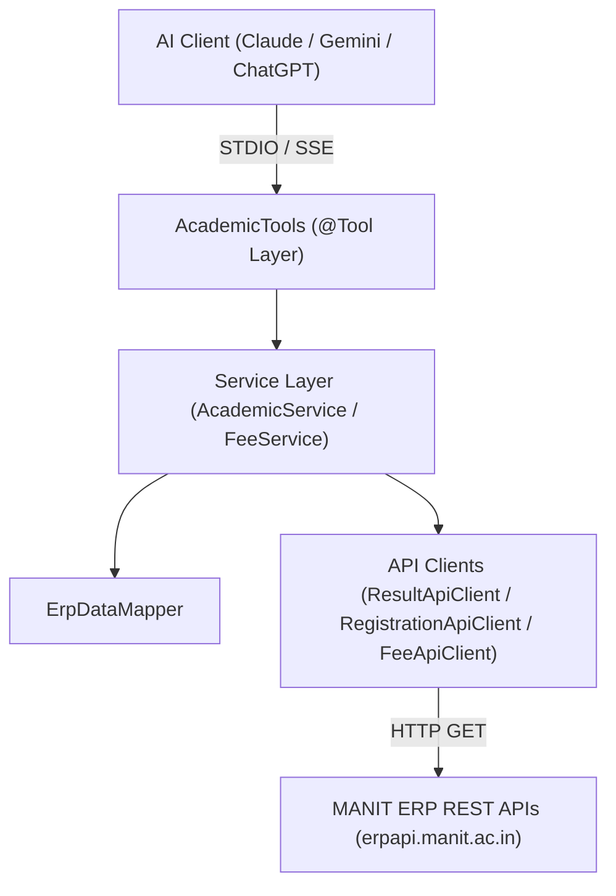


# MANIT Student ERP MCP Server

A production-ready **Model Context Protocol (MCP) Server** built with **Java 21**, **Spring Boot 3.3+**, and **Spring AI MCP Server**. This server connects to university ERP endpoints (`erpapi.manit.ac.in`) and exposes granular student academic, fee, and faculty details as focused AI Tools for **Claude**, **Gemini**, **ChatGPT**, and **GitHub Copilot Chat**.

---

## Architecture Overview

The MCP server follows Clean Architecture principles, ensuring strict separation of concerns, immutability via Java 21 Records, and focused data delivery to LLMs.



---

## MCP Tools Overview

Below is the summary of all 4 exposed MCP tools and their technical specifications:

| Tool Name | Description | Input Parameters | Return Response |
|---|---|---|---|
| `getFeeDetailsPerSemester` | Returns complete fee details and line-item breakdown for a specific semester. | `semester` (`int`, Mandatory): Semester term number (e.g. `5`) | `FeePerSemesterResponse` (semester, totalAmount, itemCount, items) |
| `getFeeDetailPerItem` | Retrieves student fee details filtered by item title, semester, or amount range. | `item` (`String`, Optional)<br>`semester` (`Integer`, Optional)<br>`minAmount` (`BigDecimal`, Optional)<br>`maxAmount` (`BigDecimal`, Optional) | `FeeDetailResponse` (totalAmount, matchCount, feeItems) |
| `getSubjectMarksPerSubject` | Returns examination marks, grade, grade points, and credits for a specific subject code or name. | `subject` (`String`, Mandatory): Subject code (e.g. `MDS323`) or title (e.g. `Data Mining`) | `SubjectMarksResponse` (subjectCode, subjectName, semester, midTermMarks, endTermMarks, marksObtained, grade, credit) |
| `getSubjectFacultyPerSubject` | Returns assigned faculty instructor name, semester, and department for a subject. | `subject` (`String`, Mandatory): Subject code or title | `SubjectFacultyResponse` (subjectCode, subjectName, facultyName, semester, department) |

---

## AI Client Integration Guide

> [!IMPORTANT]
> **Authentication Token Configuration:**
> You must provide the environment variable `ERP_AUTH_TOKEN` containing your MANIT ERP Bearer token **without** the word `Bearer` prefix (obtained from the MANIT ERP portal session/network tab).

### 1. Integration with Claude (Claude Desktop / Claude Code)

To integrate this MCP server with **Claude Desktop**, add the server configuration to your `claude_desktop_config.json` file:

- **Windows Path:** `%APPDATA%\Claude\claude_desktop_config.json`
- **macOS Path:** `~/Library/Application Support/Claude/claude_desktop_config.json`

```json
{
  "mcpServers": {
    "manit-erp": {
      "command": "java",
      "args": [
        "-jar",
        "C:/path/to/student-erp-mcp-server-1.0.0-SNAPSHOT.jar"
      ],
      "env": {
        "ERP_AUTH_TOKEN": "your_bearer_token_here_without_the_word_Bearer"
      }
    }
  }
}
```

---

### 2. Integration with Gemini (Gemini CLI / Goose / Desktop MCP Clients)

For Gemini-based AI tools supporting MCP (such as Gemini CLI or Goose):

Add the server to your MCP configuration file (e.g., `~/.config/gemini/mcp.json` or `config.yaml`):

```json
{
  "mcpServers": {
    "manit-erp": {
      "command": "java",
      "args": [
        "-jar",
        "C:/path/to/student-erp-mcp-server-1.0.0-SNAPSHOT.jar"
      ],
      "env": {
        "ERP_AUTH_TOKEN": "your_bearer_token_here_without_the_word_Bearer"
      }
    }
  }
}
```

---

### 3. Integration with ChatGPT (ChatGPT Desktop / Open WebUI / Custom GPTs)

For ChatGPT clients supporting STDIO or SSE MCP bridges (such as Open WebUI or MCP-proxy bridges):

1. **STDIO Bridge Configuration:**
   ```json
   {
     "mcpServers": {
       "manit-erp": {
         "command": "java",
         "args": [
           "-jar",
           "C:/path/to/student-erp-mcp-server-1.0.0-SNAPSHOT.jar"
         ],
         "env": {
           "ERP_AUTH_TOKEN": "your_bearer_token_here_without_the_word_Bearer"
         }
       }
     }
   }
   ```

2. **HTTP/SSE Mode (if using web bridge):**
   Set `ERP_AUTH_TOKEN` in your environment, run the Spring Boot application on port 8080, and point your MCP SSE client to:
   ```
   http://localhost:8080/mcp/sse
   ```

---

## How to Build & Run Locally

### Prerequisites
- **Java 21+** (`java -version`)
- **Apache Maven 3.9+** (`mvn -version`)

### Build Command
```bash
mvn clean package -DskipTests=false
```

### Run Executable JAR
```bash
java -DERP_AUTH_TOKEN="your_bearer_token_here_without_the_word_Bearer" -jar target/student-erp-mcp-server-1.0.0-SNAPSHOT.jar
```

---

## Sample Prompts for LLM Testing

1. *"Show my fee details for semester 5."*
2. *"How much is my Hostel Rent?"*
3. *"Show my library fee for semester 5."*
4. *"Show fees between 1000 and 5000."*
5. *"What marks did I get in Data Mining (MDS323)?"*
6. *"Who is teaching MDS323?"*
